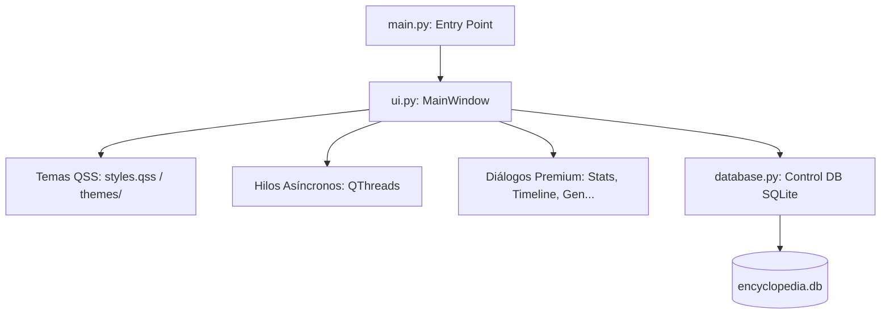

# 🪐 Enciclopedia Planetaria Universal — Documentación del Sistema

Este documento describe la arquitectura técnica, el diseño visual y los módulos funcionales del software de construcción de mundos para escritores, directores de juego (GMs) y desarrolladores creativos. Además, detalla cómo personalizar y mejorar la interfaz para llevar el producto a un nivel comercial aún más elevado.

---

## 🏛️ Arquitectura del Sistema

El proyecto está diseñado bajo un modelo híbrido centrado en **PyQt6** para la interfaz de usuario, y **SQLite3** como motor de base de datos relacional y motor de búsqueda de texto completo (FTS5).



### 1. Núcleo del Sistema (Backend & DB)
* **[database.py](file:///c:/Users/LUCK/Downloads/enciclopedia/database.py)**: Administra todas las operaciones SQL. Implementa:
  * **Optimización de SQLite (WAL Mode)**: Configura pragmas de alto rendimiento (`PRAGMA journal_mode=WAL`, `synchronous=NORMAL`, `cache_size=-65536`) para evitar bloqueos del hilo principal ante bases de datos masivas.
  * **Motor de Búsqueda FTS5**: Crea un índice virtual unificado por planeta (`fts_planet_<id>`) con disparadores automáticos (triggers) para inserción, actualización y borrado. Esto permite búsquedas universales instantáneas (sub-milisegundo).
  * **Backups Seguros**: Utiliza la API nativa `sqlite3.backup()` para copiar datos de forma transaccional y en vivo.
* **[utils_generators.py](file:///c:/Users/LUCK/Downloads/enciclopedia/utils_generators.py)**: Provee los algoritmos semánticos y diccionarios de sílabas para la generación de nombres, ubicaciones y rasgos psicológicos.

### 2. Capa de Presentación (Frontend)
* **[ui.py](file:///c:/Users/LUCK/Downloads/enciclopedia/ui.py)**: Define la ventana principal y los diálogos modales. Se divide en:
  * **MainWindow**: Administra el árbol lateral de planetas, la barra de herramientas, la barra de búsqueda con debounce (retardo de 300ms para evitar sobrecargar la BD), y la carga perezosa (Lazy Loading) de las pestañas activas.
  * **Inspector Lateral**: Visualiza y edita los campos del registro seleccionado. Soporta carga interactiva de imágenes mediante arrastrar y soltar (Drag and Drop).
  * **QThreads especializados**:
    * `PlanetLoaderThread`: Carga conteos y niveles en segundo plano para que el inicio de la app sea inmediato.
    * `CsvImportThread`: Carga masiva de datos en bloque.
    * `ClonePlanetThread` y `BackupAndTruncateThread`: Ejecutan copias y purgas masivas sin congelar la ventana.

---

## 🎨 Personalización Estética y Temas QSS

La interfaz visual se controla mediante hojas de estilo **QSS (Qt Style Sheets)**, que equivalen al CSS de las aplicaciones web.

### Directorio de Temas:
* **Tema Principal**: [styles.qss](file:///c:/Users/LUCK/Downloads/enciclopedia/styles.qss) (Estilo Clásico Oscuro Glassmorphic).
* **Temas Adicionales**: Ubicados en la carpeta [themes/](file:///c:/Users/LUCK/Downloads/enciclopedia/themes/):
  * `dnd.qss`: Estética de pergamino y tonos granates.
  * `hollow_knight.qss`: Paleta azul sombría y gris carbón.
  * `warhammer.qss`: Colores industriales oscuros y bordes afilados.

---

## 🚀 Cómo hacer la interfaz más hermosa y personalizada

Si deseas monetizar la aplicación o empaquetarla como un producto premium en plataformas como Steam o Epic Games Store, aquí tienes las acciones de diseño y código que debes realizar:

### 1. Implementar Animaciones de Transición
Qt permite animar la geometría, opacidad y colores de cualquier botón o panel usando `QPropertyAnimation`. 
* **Ejemplo de código para animar la aparición de un panel**:
  ```python
  from PyQt6.QtCore import QPropertyAnimation, QEasingCurve
  
  self.anim = QPropertyAnimation(self.sidebar_widget, b"maximumWidth")
  self.anim.setDuration(300)
  self.anim.setStartValue(0)
  self.anim.setEndValue(280)
  self.anim.setEasingCurve(QEasingCurve.Type.InOutQuad)
  self.anim.start()
  ```
* **Aplicación**: Añadir transiciones suaves cuando el usuario cambie de pestaña, abra el inspector lateral o ejecute búsquedas globales.

### 2. Integrar Iconografía SVG de Alta Calidad
En lugar de emojis o texto plano en los botones, utiliza archivos SVG vectoriales (como Lucide o FontAwesome).
* Carga los iconos de esta manera en [ui.py](file:///c:/Users/LUCK/Downloads/enciclopedia/ui.py):
  ```python
  from PyQt6.QtGui import QIcon
  self.btn_name_gen.setIcon(QIcon("assets/icons/wand.svg"))
  ```
* Define un directorio `assets/icons/` y mantén una estética coherente (líneas minimalistas de 1.5px de grosor).

### 3. Habilitar Efectos Blur / Translucidez (Mica / Acrylic)
En Windows 11, puedes aplicar efectos de translucidez nativos del sistema operativo a tus ventanas de Qt mediante bibliotecas de integración como `PyQtDarkTheme` o llamadas a la API de Windows a través de `ctypes` para activar el material Acrylic/Mica en la barra de título.

### 4. Ofrecer un Editor Visual de Temas (Customizer)
Permite al usuario crear su propia hoja de estilos sin escribir código:
1. Crea un diálogo `CustomizerDialog` con selectores de color (`QColorDialog`).
2. Guarda los colores seleccionados en un archivo JSON (ej: `user_theme.json`).
3. Reemplaza variables en una plantilla QSS base y aplícala dinámicamente con `app.setStyleSheet()`.

---

## 🛠️ Nuevas Opciones de Libertad y Funcionalidades Sugeridas

Para dar más libertad y control creativo a tus usuarios, puedes expandir el software con los siguientes módulos:

### A. Soporte para Markdown / Rich Text en Descripciones
Sustituye el componente de texto estándar `QPlainTextEdit` del inspector por un editor que soporte formato Markdown y renderice HTML dinámico en el "Modo Lore". Puedes utilizar `QTextEdit` y habilitar su parser interno de Markdown:
```python
# Cargar contenido formateado
text_edit.setMarkdown(markdown_content)
```

### B. Módulo de Redes de Relaciones (Grafo Visual)
Crea una vista gráfica interactiva que dibuje las conexiones entre personajes, facciones e ítems de un planeta utilizando la clase `QGraphicsView` y `QGraphicsScene`. Al dibujar nodos (entidades) y aristas (relaciones), los escritores podrán ver mapas mentales dinámicos del lore de su mundo.

### C. Generación Procedural con Inteligencia Artificial (API Local / OpenAI)
Añade una pestaña en la suite de generación para conectarse a un LLM local (vía Ollama) o una clave de API comercial:
* **Función**: Al hacer clic en "Expandir NPC con IA", el sistema leerá los rasgos básicos generados y redactará automáticamente una historia de trasfondo detallada y diálogos de ejemplo en el inspector.

---

## ⚡ Módulo RPG: Yunque de Combinación y Simulador de Ficha

Este módulo representa el núcleo creativo del proyecto y ha sido completamente integrado en el menú superior (**⚡ Simulador RPG**). Convierte el software de una base de datos estática en un motor interactivo de diseño y balance de mecánicas de rol.

### 1. El Yunque de Combinación (Class Forge)
Permite a los directores de juego combinar conceptos temáticos (Elementales, Físicos, Mentales) de la base de datos para calcular su sinergia con las clases jugables.
* **Cálculo de Sinergia**: Analiza las palabras clave de la descripción de la clase y las bonificaciones de los conceptos para calcular un porcentaje de estabilidad.
* **Mutación**: Al hacer clic en "Forjar Mutación", se guardan los conceptos seleccionados como requisitos directos en la descripción de la clase en SQLite, automatizando la progresión del lore.

### 2. Simulador de Ficha RPG
Permite a los usuarios diseñar y escalar fichas de personajes jugables a cualquier nivel (1-100).
* **Escalado Dinámico**: Modifica las estadísticas principales (Fuerza, Agilidad, Inteligencia, Vitalidad) basándose en las curvas de crecimiento de cada clase (guerrero, mago, tanque, etc.).
* **Modificaciones por Conceptos**: Aplica multiplicadores porcentuales o valores planos a los atributos del personaje analizando las bonificaciones de los conceptos equipados.
* **Cálculo de Estadísticas Derivadas**: Calcula automáticamente Puntos de Vida (HP), Maná (MP), Daño Físico, Poder Mágico y Velocidad de Acción.
* **Visualización Gráfica**: Utiliza un gráfico de barras comparativo (dibujado mediante `RpgStatsChartWidget` con `QPainter`) para mostrar visualmente los atributos base en contraste con los bonos otorgados por conceptos.
* **Exportación**: Permite guardar las fichas completas como archivos Markdown (.md) en el disco duro.

### 3. Arena de Combate y Balance Simulator (Combat Arena)
Añade un simulador de batallas por turnos automatizado e interactivo para validar y balancear las mecánicas de juego:
* **Escalado de Criaturas**: Permite combatir contra criaturas de la base de datos, escalando sus estadísticas automáticamente a su nivel según su Peligrosidad y Rareza.
* **Sistema de Combate Dinámico**: Los combatientes acumulan medidores de iniciativa según su Velocidad. Al actuar, pueden lanzar hechizos o curaciones de forma inteligente consumiendo Maná (usando habilidades de la BD) o realizar ataques físicos que pueden ser críticos.
* **Registro de Combate (Log)**: Muestra el flujo detallado de turnos, daños, críticos y curaciones con estilos visuales en un visor enriquecido HTML.
* **Benchmark de Balance**: Ejecuta 100 combates instantáneos en segundo plano y genera un reporte estadístico de Win Rate (Tasa de Victorias) de cada bando con sugerencias automáticas de balance.

### 4. Editor de Fórmulas y Reglas de Juego (Custom Rules Engine)
Permite modificar los cimientos numéricos del RPG de forma dinámica para adaptarlo a cualquier sistema de rol o tabletop:
* **Ecuaciones Personalizadas**: Permite cambiar la fórmula de cálculo de HP, MP, Daño de Ataque, Poder de Hechizo y Velocidad usando variables (`str`, `agi`, `int`, `vit`).
* **Persistencia por Planeta**: Las ecuaciones personalizadas se guardan en la tabla `p_<planet_id>_game_rules`, permitiendo que cada planeta de tu multiverso tenga sus propias reglas de juego independientes.
* **Evaluador Seguro**: El motor de ecuaciones evalúa la sintaxis de forma aislada y con manejo de excepciones. Si detecta un error de sintaxis del usuario, revierte al valor predeterminado de forma segura sin romper la aplicación.

---

## 🔗 Red de Relaciones Semánticas y Grafo de Lore
Esta funcionalidad eleva la enciclopedia a un motor de base de datos de lore interconectado (estilo wiki semántica):
* **Tabla de Vínculos**: A través de `p_<planet_id>_relaciones`, se asocia cualquier fila de una categoría con otra (ej: NPC A es "Líder de" la Facción B).
* **Navegación Cruzada**: En el inspector lateral se despliegan todos los vínculos entrantes y salientes. Hacer doble clic sobre cualquier relación mueve la aplicación automáticamente a la pestaña correspondiente y selecciona la fila enlazada.
* **Buscador Seguro (Antilag)**: El diálogo de enlace usa un filtrado con `LIMIT` por búsqueda para permitir buscar y enlazar sobre tablas de millones de filas (como criaturas o plantas) instantáneamente y sin lag de memoria.
* **Grafo Visual de Redes**: Abre un visor de red donde el nodo seleccionado se ubica en el centro y se dibuja con líneas orientadas a sus nodos adyacentes. El grafo es interactivo: hacer clic en cualquier burbuja re-centra el gráfico y carga sus conexiones en tiempo real.

---

## 🎲 Generación Masiva Procedimental (Mass Generator)
Permite poblar mundos de gran escala en cuestión de milisegundos en segundo plano:
* **Generación Dinámica por Esquema**: Detecta automáticamente las columnas y tipos de datos de cualquier categoría seleccionada (incluso personalizadas) y las puebla de forma inteligente (ej: nombres fantásticos para textos, rangos numéricos acotados para niveles, elementos aleatorios para habilidades).
* **Escritura Transaccional de Alta Velocidad**: Inserta lotes de hasta 1,000 registros mediante un solo commit de transacción SQLite, logrando grabaciones masivas en menos de 50ms sin bloquear el hilo de ejecución principal.
* **Integración de Barra de Progreso**: Muestra el porcentaje y mensajes del hilo secundario (`MassGeneratorThread`) en tiempo real.

---

## 💎 RPG Worldbuilding & Lore Engine Suite (Mejora 1000%)

Esta suite eleva el software de una enciclopedia estática a un entorno de desarrollo creativo interactivo, inyectando libertad creativa absoluta, enlaces inteligentes y simulación activa de campañas.

### 1. 🗺️ Cartografía Planetaria Interactiva
* **Lienzo Espacial Avanzado**: Integra un lienzo interactivo (`MapGraphicsView` & `QGraphicsScene`) que renderiza imágenes de mapas personalizadas con paneo de arrastre y zoom mediante rueda del mouse.
* **Pines de Lore Dinámicos**:
  - Doble clic en cualquier cuadrante del mapa abre `AddPinDialog` para colocar un marcador (`MapPinItem`) en coordenadas porcentuales escalables.
  - Cada pin se enlaza a un registro de cualquier categoría de la base de datos con buscadores optimizados por indexación (`LIMIT 50`).
  - Arrastrar un pin en el mapa actualiza automáticamente sus coordenadas `(x, y)` de forma transaccional en la tabla `p_<planet_id>_map_pins`.
  - Un clic en un pin enfoca y resalta inmediatamente el registro en la ventana principal.

### 2. ⚙️ Motor de Atributos RPG Personalizados (Libertad Total)
* **Atributos Dinámicos**: Permite a los GMs añadir identificadores cortos (ej: `lck`, `fth`, `san`) y etiquetas visuales desde el panel de Reglas.
* **Inyección en Ficha de Personaje**: Los inputs de PyQt6 (`QSpinBox`) para estos nuevos atributos se autogeneran e inyectan en el panel del personaje de forma reactiva.
* **Fórmulas Dinámicas**: Los atributos personalizados pueden utilizarse directamente en las ecuaciones matemáticas de cálculo seguro (ej: `formula_hp = vit * 12 + lck * 2`).
* **Sinergias de Lore**: El parser de conceptos de progresión (`_parse_bonus`) mapea automáticamente multiplicadores o bonos planos dirigidos a estos atributos personalizados.

### 3. 📜 Gestor de Misiones y Campañas
* **Estructura Narrativa**: Organiza misiones independientes o cadenas de campañas a través de la tabla `p_<planet_id>_quests`.
* **Enlaces Semánticos**: Vincula personajes notables como dadores de misiones (`giver_id`) y monstruos, locaciones o facciones como objetivos (`destino_id`).
* **Simulación en Tiempo Real**: Un motor de eventos narrativos simula el progreso y entrega de misiones, recompensas de EXP/Oro y actualiza el estado interactivo a *"Completada"* de forma automatizada.

### 4. 🔗 Wikilinks y Auto-vínculos de Lore
* **Sintaxis Wiki**: Permite cruzar el lore de forma natural en los campos de descripción utilizando la sintaxis de doble corchete `[[NPCs Notables:Merlín]]` o `[[Facciones:La Garra Roja]]`.
* **Hipervínculos Interactivos**: El visor de "Modo Lore" convierte dinámicamente esta sintaxis en links HTML clicables dentro de un `QTextBrowser`.
* **Navegación al Instante**: Hacer clic en un hipervínculo navega automáticamente a la pestaña correspondiente del inspector principal, forzando la carga lazy y resaltando la fila enlazada.
* **Tooltips de Vista Previa**: Pasar el cursor sobre un wikilink muestra un tooltip flotante que incluye un fragmento de la descripción del registro vinculado en tiempo real.

### 5. 🪐 Forjador de Lore Planetario (World Forge)
* **Generación Procedural Conectada**: Forja en segundo plano (`WorldForgeThread`) un continente completo con nombres aleatorios geográficos, naciones, ciudades, gremios/facciones y personajes notables.
* **Relaciones Lógicas Autogeneradas**: Los registros creados no son planos; se interconectan lógicamente mediante `p_<planet_id>_relaciones` (ej: el NPC gobierna la ciudad; la facción tiene sede en el puerto; la reliquia fue forjada por el rey).
* **Escritura en Bloque Transaccional**: Inserta decenas de entidades complejas en milisegundos en una sola transacción SQLite y actualiza el motor FTS5 de forma autónoma.


